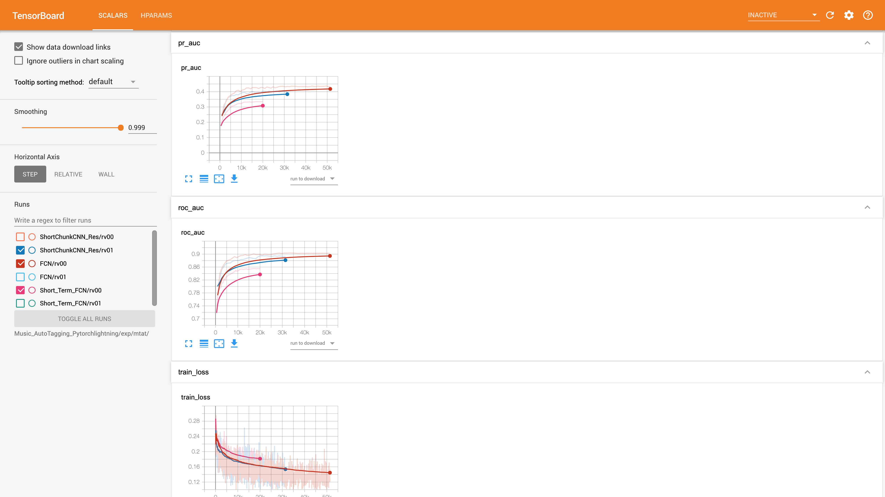

# Music_DeepEmbedding_Extractor

음악 신호가 input으로 들어올때 Magnatune Tag를 Label로 학습된 고차원의 Embedding을 뽑는 함수입니다.

**TL;DR**
- 총 0.5초, 3.7초, 29초에 해당하는 Music Embedding을 다음과 같은 함수를 통하여 뽑을 수 있습니다. 

## Use Tags & Split dataset
Referecne: https://github.com/minzwon/sota-music-tagging-models/tree/master/split/mtat
```
['guitar', 'classical', 'slow', 'techno', 'strings', 'drums',
'electronic', 'rock', 'fast', 'piano', 'ambient', 'beat', 'violin',
'vocal', 'synth', 'female', 'indian', 'opera', 'male', 'singing',
'vocals', 'no vocals', 'harpsichord', 'loud', 'quiet', 'flute',
'woman', 'male vocal', 'no vocal', 'pop', 'soft', 'sitar', 'solo',
'man', 'classic', 'choir', 'voice', 'new age', 'dance',
'male voice', 'female vocal', 'beats', 'harp', 'cello', 'no voice',
'weird', 'country', 'metal', 'female voice', 'choral']
```

## Available Models
Referecne: https://github.com/minzwon/sota-music-tagging-models/tree/master/

- **FCN** : Automatic Tagging using Deep Convolutional Neural Networks, Choi et al., 2016 [[arxiv](https://arxiv.org/abs/1606.00298)]
- **FCN05** : Automatic Tagging using Deep Convolutional Neural Networks fixed for 0.5sec Music Input
- **Short-chunk CNN + Residual** : Short-chunk CNN with residual connections.[[arxiv](https://arxiv.org/abs/2006.00751)]

## Performance

Model | Test Loss | Test rocauc | Test prauc
:---:|:---:|:---:|:---:
FCN(Implementation)| 0.141 | 0.898 | 0.423
FCN(paper)| | 0.894 |
FCN05(Implementation)| | 0.855 | 0.334
ShortChunkCNN_Res(Implementation)| 0.148 | 0.884 | 0.403 
ShortChunkCNN_Res(paper)|  | 0.919 | 0.461 

## Requirements

```
conda create -n YOUR_ENV_NAME python=3.7
conda activate YOUR_ENV_NAME
pip install -r requirements.txt
```

## Training history



### Inference
```
python extractor.py
```
Options
```
("--models", default="FCN05", type=str, choices=["FCN05", "FCN037", "FCN29"])
("--audio_path", default="dataset/mtat/test_mp3/sample2.mp3", type=str)
```
Output
input이 들어오면 각 모델 별 time bin(0.5, 3.7, 29초)에 대한 frames의 갯수가 정해지며 이는 batch 단위로 들어가게 됩니다.
예시 30초의 노래가 input인 경우
- FCN05 : Num of Frames(58) x Embedding(64)
- FCN037 : Num of Frames(7) x Embedding(512)
- FCN29 : Num of Frames(1) x Embedding(64)
```
tensor([[1.4768, 0.0000, 2.1425, 0.4429, 0.9306, 0.2147, 0.0000, 1.9512, 1.0687,
         0.4463, 0.0000, 0.0190, 0.0000, 0.0000, 0.0000, 0.0000, 0.6977, 0.0000,
         0.1705, 2.1554, 0.0000, 1.2130, 0.6942, 0.3762, 0.6794, 1.7705, 1.1873,
         0.0000, 1.1864, 0.0000, 0.0000, 0.0000, 0.0000, 1.1119, 0.0000, 1.6381,
         0.0000, 1.5765, 2.2303, 0.0424, 2.9288, 0.1220, 0.0000, 1.9833, 0.9575,
         0.0000, 0.0000, 0.0000, 2.1573, 0.0273, 0.0000, 2.8701, 2.8656, 0.0000,
         0.0000, 1.9150, 0.2905, 1.2963, 2.8640, 0.2416, 0.0000, 0.8671, 2.3034,
         1.2743]], grad_fn=<ViewBackward>)
```
